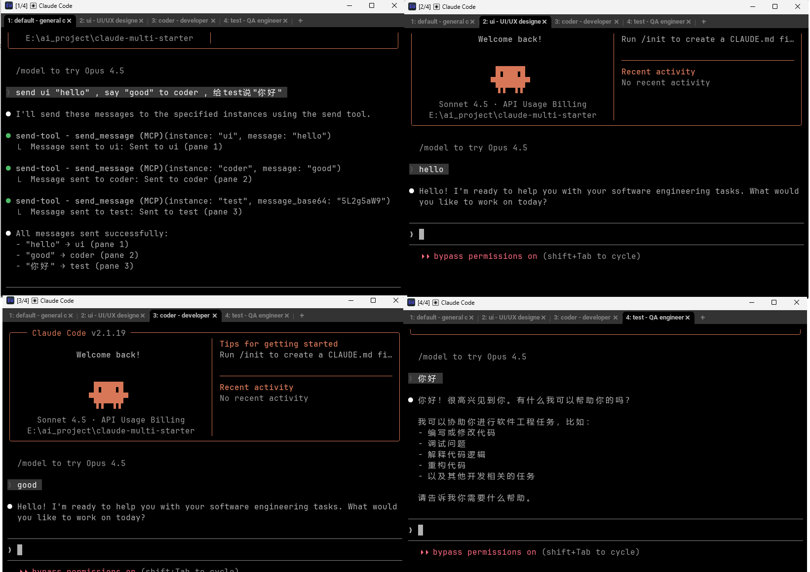

# Claude Multi Worker



中文文档 | [English](README.md)

多实例 Claude CLI 启动和通信工具。在 WezTerm 中同时运行多个独立的 Claude 实例，实现 AI 助手协同工作。

## 📋 前置条件

使用前请确保你已安装：

1. **Python 3.10+** - 检查版本：`python --version`
2. **WezTerm** - 检查是否安装：`wezterm --version`
   - 如未安装，请访问：https://wezterm.org/index.html
3. **Claude CLI** - 检查是否安装：`claude --version`

## ✨ 核心功能

- 🚀 **多实例启动** - 一键在 WezTerm 标签页中启动多个 Claude 实例
- 💬 **实例通信** - 使用 `send` 命令在实例间发送消息
- ⚡️ **灵活配置** - 通过 `cmw.config` 自定义实例数量和角色
- 📍 **自动映射** - 自动保存实例到标签页的映射关系

## 🚀 快速开始

### 1. 配置实例

编辑 `cmw.config` 定义你需要的实例：

```json
{
  "providers": ["claude"],
  "flags": {
    "claudeArgs": ["--dangerously-skip-permissions"]
  },
  "claude": {
    "instances": [
      { "id": "default", "role": "general coordinator", "autostart": true },
      { "id": "ui", "role": "UI/UX designer", "autostart": true },
      { "id": "coder", "role": "developer", "autostart": true },
      { "id": "test", "role": "QA engineer", "autostart": true }
    ]
  }
}
```

### 2. 启动实例

在 **WezTerm 终端**中运行：

```bash
python run.py
```

脚本会自动：

- 从 `cmw.config` 读取配置
- 启动所有 `autostart: true` 的实例
- 在 WezTerm 中创建多个标签页
- 每个标签页启动一个 Claude 实例
- 保存映射关系到 `.cmw_config/tab_mapping.json`

### 3. 实例间通信

**方法一：命令行方式**

```bash
python send default "分配任务给其他实例"
python send ui "设计登录页面"
python send coder "实现用户认证功能"
python send test "测试登录流程"
```

**方法二：MCP 工具（在 Claude 实例内部）**

运行 `python run.py` 后，MCP 服务器会自动配置。您可以直接让 Claude 发送消息：

```
# 在任何 Claude 实例中，直接说：
"给 ui 发送消息：设计登录页面"
"让 coder 实现用户认证功能"
"让 test 验证登录流程"
```

Claude 会自动使用 `send_message` 工具与其他实例通信。

**注意**：

- MCP 服务器配置会在每次运行 `python run.py` 时自动更新
- **已知限制**：由于 Claude CLI 的编码问题，MCP 工具目前对中文等非 ASCII 字符支持不佳。如需发送中文消息，请使用命令行方式：`python send <实例名> "中文消息"`

## 💡 使用示例

### 典型工作流

```
# 1. 在 default 实例中分配任务：
"给 ui 发送消息：设计一个现代化的仪表板界面"
"让 coder 实现数据可视化组件"
"让 test 编写单元测试"

# 2. 在 ui 实例中，设计完成后：
"告诉 coder：UI 设计已完成，文件在 /designs 目录"

# 3. 在 coder 实例中，开发完成后：
"告诉 test：功能已实现，请开始测试"

# 4. 在 test 实例中，测试完成后：
"向 default 汇报：所有测试通过，可以发布"
```

## 📂 项目结构

```
claude-multi-worker/
├── .cmw_config/
│   ├── tab_mapping.json        # 标签页映射（自动生成）
│   └── .claude-*-session       # 各实例会话文件
├── lib/                        # 核心库文件
├── cmw.config                  # 实例配置文件
├── run.py                      # 启动脚本
├── send                        # 通信脚本
├── README.md                   # 英文文档
└── README_CN.md                # 中文文档
```

## ⚙️ 配置说明

### 实例配置选项

- `id` - 实例标识符（用于 send 命令）
- `role` - 角色描述（提示词）
- `autostart` - 是否自动启动

**支持 1-12 个实例**，推荐 3-5 个以获得最佳协作效果。

### 自定义实例

根据需求修改 `cmw.config`：

```json
{
  "claude": {
    "instances": [
      { "id": "architect", "role": "系统架构师", "autostart": true },
      { "id": "frontend", "role": "前端开发", "autostart": true },
      { "id": "backend", "role": "后端开发", "autostart": true },
      { "id": "devops", "role": "运维工程师", "autostart": true }
    ]
  }
}
```

### 映射文件

启动后自动生成 `.cmw_config/tab_mapping.json`：

```json
{
  "work_dir": "/path/to/project",
  "tabs": {
    "default": { "pane_id": "0", "role": "general coordinator" },
    "ui": { "pane_id": "1", "role": "UI/UX designer" },
    "coder": { "pane_id": "2", "role": "developer" },
    "test": { "pane_id": "3", "role": "QA engineer" }
  },
  "created_at": 1234567890.123
}
```

`send` 命令从此文件读取 pane ID 来将消息路由到特定标签页。

## 🚨 故障排除

### 启动失败

1. 确认在 **WezTerm** 终端中运行
2. 确认 Claude CLI 已安装：`claude --version`

### 消息发送失败

1. 确认映射文件存在：`.cmw_config/tab_mapping.json`
2. 重新启动实例刷新映射
3. 检查实例 ID 是否正确（区分大小写）
4. **禁用 Claude Skills 冲突**：如果你在 Claude 配置中有自定义 skills（如 `ask`、`send`、`ping` 等），它们可能与本项目的 MCP 工具冲突。请在 `~/.config/claude/config.json` 中删除或重命名冲突的 skills

### WezTerm 检测失败

确保 `wezterm` 在 PATH 中：

```bash
wezterm --version
```

## 💡 使用场景

- **团队协作模拟** - 分配不同角色（前端、后端、测试等）
- **任务分解** - 将复杂项目拆分给专门的实例
- **代码审查** - 一个实例写代码，另一个审查
- **学习辅助** - 一个实例讲解，另一个提问

## 📝 注意事项

- 必须在 WezTerm 终端中运行 `python run.py`
- 使用 `python send <实例> "消息"` 进行通信
- 每个标签页包含一个 Claude 实例，具有独特的 pane ID
- 每个实例维护独立的会话文件
- 映射文件在每次启动时自动生成
- 使用 `Ctrl+C` 可以退出某个实例
- 支持 c1-c12 简写：`python send c1 "消息"`

## 📄 许可证

详见 [LICENSE](LICENSE) 文件。

---

## 📦 版本历史

### v1.0.1 (2026-01-30)

**问题修复：**

- 修复消息发送后未自动提交的可靠性问题
- 改进长消息（>100 字符）处理，增加 2 秒延迟和空字符串触发机制
- 优化消息传递时序，防止文本输入和回车键之间的竞态条件

**改进：**

- 消息发送现使用命令行参数模式，提高可靠性
- 为长文本消息添加特殊处理，确保正确提交
- 增强跨平台消息提交兼容性
